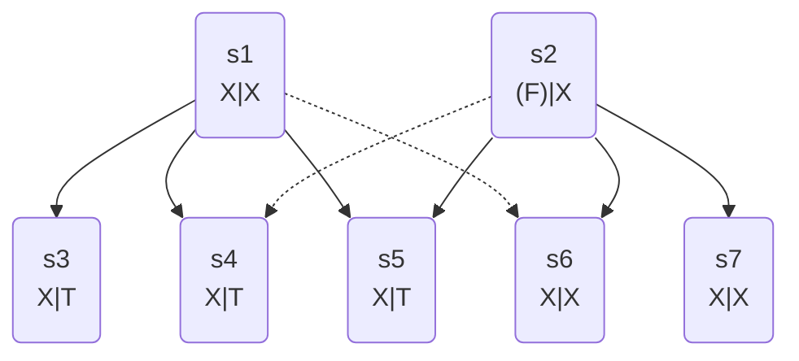

```mermaid
  graph TD;
    s1("s1<br>X|X")--> s3("s3<br>X|T") & s4("s4<br>X|T") & s5("s5<br>X|T");
    s1 -.-> s6("s6<br>X|X");
    s2("s2<br>(F)|X") --> s5 & s6 & s7("s7<br>X|X");
    s2-.-> s4;
```
